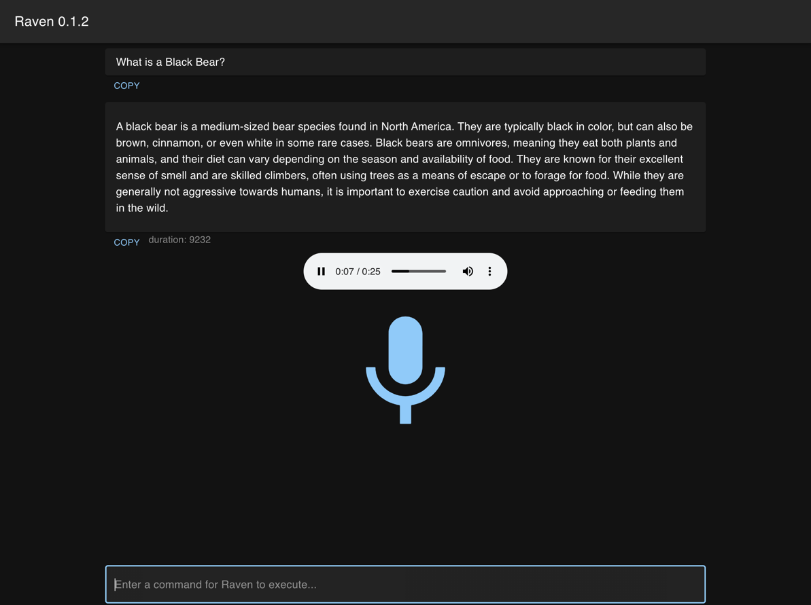

# Raven 

Raven is a work-in-progress with two main goals:

1. Implement a simulated multi-modal AI using OpenAI Whisper where you can speak to GPT4 directly.
2. Tree / smart execution of pre-fetching questions 
3. Build an agent framework that allows for advanced use cases 
4. Vector Database and Document Indexing

Also, please note.  This repo is NOT up to my normal high quality standards I hold for myself.  I don't have eslint setup properly.  Prettier isn't setup. etc.  

This is still Alpha code.

Everything is based on Next, React, and Typescript. 

I'm probably going to add python-based cloud function to integrate with Pinecode or Zilliz when I add support for vector databases.

# Multi-Modal



Right now OpenAI and GPT4 isn't a multi-modal model, meaning you can't speak to it as it does not support voice.

When I found out about [Whisper](https://openai.com/research/whisper), and their claim about it's performance, I had to build out a text interface to OpenAI.

It was initially designed for my niece (Young Lady's Illustrated Primer) and she and her mom use it to read her bedtime stories. ❤️

It has a few limitations:

- There are some problems getting streaming working properly with the 'openai' Node client and the latencies can be seriously improved.
- I need to improve error handling and clean up the code a bit more as it's mostly a PoC.

# Tree / Smart Execution of Pre-fetching Questions


One of the downsides of GPT4 is the latency.

I'm very excited about vector databases and using context injection with GPT4 and its support for 8k and 32k prompt sizes.

However, the responses are just too slow to make it work in realtime.

I had an idea that I can have a prompt actually compute the NEXT nodes that the user is probably going to want, then prefetch them.

For example, we could use a prompt like:

```text
You are a research assistant.  When the user asks a question you will answer it
in 2-3 paragraphs, and then emit 5 questions the user is most likely to ask based
on the result.  

You will prefix these questions with "---" and each question will be on its own line. 

```

Then a user message would look like:

```text
What is Python?
```

... to which GPT4 would reply with:

```text
Python is a high-level, interpreted programming language known for its simplicity, readability, and ease of use. It was first released in 1991 by Guido van Rossum and has since become one of the most popular programming languages in use today. Python can be used for a wide variety of tasks, from web development and data analysis to artificial intelligence and machine learning.

--- 
What are some popular use cases for Python?
How do I install Python on my computer?
What are some resources for learning Python?
What are the differences between Python 2 and Python 3?
Can Python be used for web development?

```

The idea is to take the next questions, and start loading them immediately, 
thereby hiding the latency of the response so the user immediately gets their answer.

This would yield a much more exploratory and immersive experience for the user.

# Agent Framework

I think there's a massive opportunity to build agent frameworks using generative 
AI models.

Agents would be able to be long-lived and perform background tasks on behalf of the user. 

It's designed to take advantage of GPT's generative model to expand the prompt 
and compute the "tasks" to meet its goals.

The current design is being inspired by my other work with OpenAI (and this 
might change) but I think I've settled on the following architecture.

Use cases involve:

- Performing market arbitrage using GPTs language translation capabilities to buy and sell goods across multiple markets online. 

- Purchase goods and services using your browser credentials so that the agent can see the same data that you're personally using (email, slack, etc)

The general idea is that we will use a system prompt to train GPT how to invoke commands.

Then we have a prompt that is given a state, and can execute commands to potentially mutate the state to its desired goal.

Periodically, we rollup and checkpoint the state to avoid large prompt sizes.

We will also have a data layer that the agents can write to directly so that the user
can see the status of the agent.

# Vector Database and Document Indexing

For students and researchers, GPT4 is a bit limited in that you can't extend its capacity.

My plan here is to use Mathpix to allow the user to upload PDFs and documents, 
then use context injection by taking the prompt, and injecting shingled and 
pre-indexed content from the vector database.

